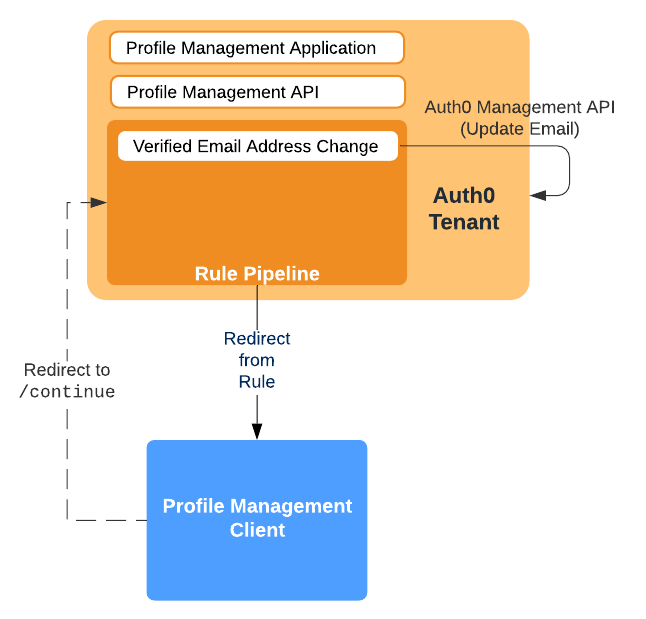

# Profile Management

This section of the repository contains sample implementation for the Profile Management functionality implemented external to Auth0, and you can use this implementation as-is, or incorporate as part of your own/existing functionality in order to support Verfiried Email Address Change in Auth0. The diagram below illustrates the architecture associated with the implementation provided. As can be seen, there is a Profile Management Client and an associated Profile Management Service, which are used in conjunction with the corresponding Auth0 [Tenant assests](../Tenant).

## Profile Management Client

The Profile [client](Profile/client) folder contains sample Node.js implementation 

## Profile Management Service

The Profile [service](Profile/service) folder contains sample Node.js implementation 

 and the [Express](https://expressjs.com/) framework

## Issue Reporting

If you have found a bug or if you have a feature request, please report them via the issues section of this repository. Please do not report security vulnerabilities on the public GitHub issue tracker. The [Responsible Disclosure Program](https://auth0.com/whitehat) details the procedure for disclosing security issues.

## License

This project is licensed under an MIT LICENSE. Please see the [LICENSE](../LICENSE) file for more info.
